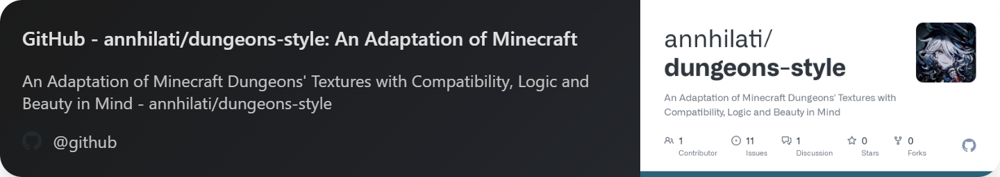

<h1 align="left">Hi 👋 My name is Annhilati</h1>

#### Python Full Stack and Minecraft Developer

<ul>
    <li>:earth_africa: I'm based in Germany</li>
    <li>:rocket: I'm currently working on as framework and service for Discord-based Minecraft communities</li>
</ul>

<!--  -->

### Stack
  

### Frameworks
  

### Some experience with
 

### Projects
